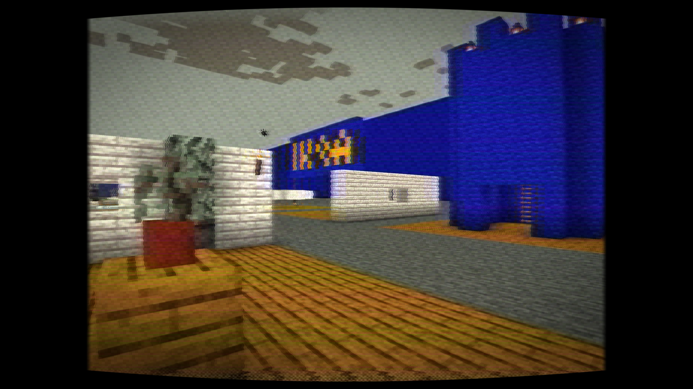
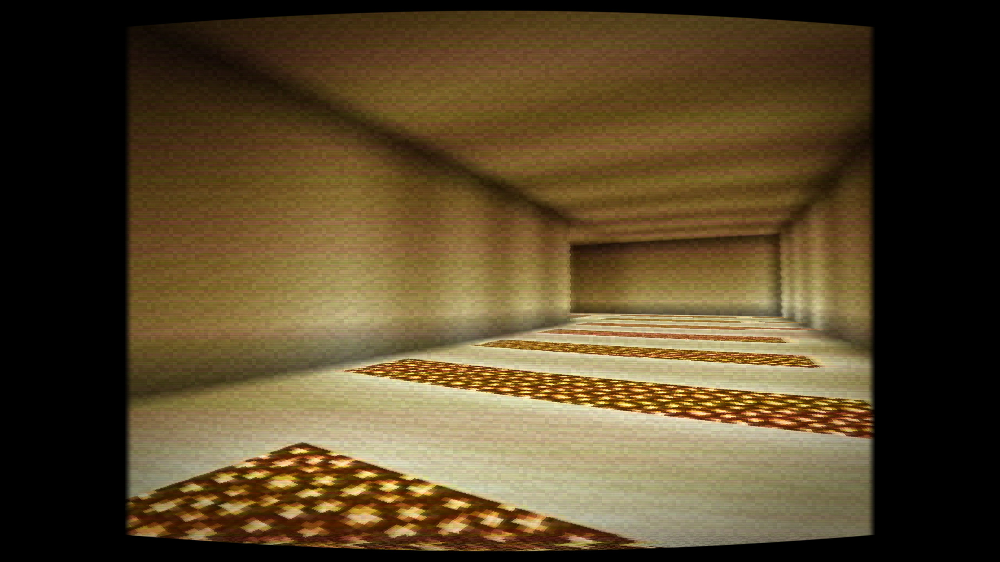
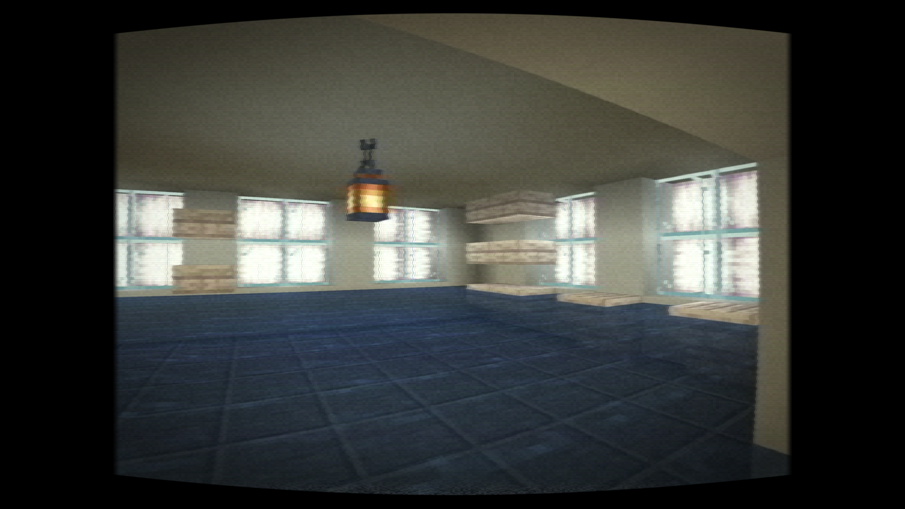

# LOST SIGNAL VHS

### Minecraft, recorded on a tape that should have stayed lost.

Lightweight analog-horror post-processing for Minecraft Java Edition. 
Scanlines, tape grain, tracking tears, color bleed, temporal ghosting, lens
distortion, sync failures, a proper signal-space YIQ pipeline, and dedicated
Backrooms, Poolrooms, and Liminal Night lighting. Version 1.9 rebuilds the
signal path around persistent depth-aware history, stateful automatic gain,
one physical composite decoder, and field-locked head switching, while making
the settings easier to navigate and keeping all thirteen preset transitions
self-contained.

  
  

## The signal

Lost Signal VHS leaves Minecraft's normal lighting intact and transforms the
finished frame into unstable found footage. Its three-pass pipeline recreates
the behavior of a cheap camera, worn tape, and a failing VCR instead of simply
placing a noise texture over the screen.

- Real horizontal scanlines, grain, flicker, and static bursts
- Tracking tears, head-switch noise, frame jitter, and curved overscan
- Chroma bleed, RGB separation, phase wobble, and YIQ color processing
- Persistent temporal ghosting using the previous processed frame
- Depth-aware motion history that follows stable geometry and rejects
  disoccluded or mismatched surfaces
- Persistent automatic gain with fast overload response and slower recovery
- One physical composite decode stage: a lightweight Performance approximation,
  a five-tap Balanced/Cinematic notch filter, and a Cinematic NTSC two-line comb
  path; PAL safely falls back to the notch decoder
- Dot crawl, cross-color rainbows, and cross-luma carrier leakage
- Persistent oxide defects tied to a continuously moving virtual tape
- Depth-based fog recorded before YIQ/tape degradation, with world-stable variation
- True NTSC/PAL field weaving through the persistent history buffer
- Field-locked head-switch displacement, chroma loss, and RF noise driven by
  one shared tape event
- Smooth mechanically correlated time-base error and feathered tracking tears
- Performance, Balanced, and Cinematic render-quality modes
- Selectable NTSC and PAL signal timing
- Delayed automatic exposure, sync failures, and tracking color loss
- Thirteen presets plus individual controls for every major effect
- Overworld, Nether, and End support without dimension-specific shaders
- English and Russian settings menus

## Gallery

<table>
  <tr>
    <td width="50%">
      
    </td>
    <td width="50%">
      
    </td>
  </tr>
  <tr>
    <td align="center">Backrooms preset</td>
    <td align="center">Tracking distortion and color bleed</td>
  </tr>
</table>

## Backrooms and analog horror

Lost Signal VHS is designed for **Backrooms maps, liminal spaces, horror
modpacks, ARGs, machinima, and found-footage videos**. The dedicated
**Backrooms preset** emphasizes sickly fluorescent color, unstable exposure,
deep tape noise, tracking loss, and damaged-camcorder movement while keeping
the scene playable.

**[Watch the 53-second Backrooms VHS trailer on YouTube](https://youtu.be/MWtnxr5Iu6Q)**

## Compatibility

| Minecraft | Recommended Iris line | Graphics backend | Status |
|---|---|---|---|
| Java Edition 26.2 | Iris 1.11.2 with Sodium | OpenGL | Supported |
| Java Edition 26.1.2 | Iris 1.11.2 with Sodium | OpenGL | Supported |
| Java Edition 1.21.11 | Iris 1.10.7 with Sodium | OpenGL | Supported |
| Java Edition 1.21.10 | Iris 1.9.7 with Sodium | OpenGL | Extended |
| Java Edition 1.21.8 | Iris 1.9.5 with Sodium | OpenGL | Extended |
| Java Edition 1.21.5 | Iris 1.8.11 with Sodium | OpenGL | Extended |
| Java Edition 1.21.4 | Iris 1.8.8 with Sodium | OpenGL | Supported |
| Java Edition 1.21.1 | Iris 1.8.12 with Sodium | OpenGL | Supported |
| Java Edition 1.20.6 | Iris 1.7.0 with Sodium | OpenGL | Extended |
| Java Edition 1.20.4 | Iris 1.7.2 with Sodium | OpenGL | Extended |
| Java Edition 1.20.1 | Iris 1.7.6 with Sodium | OpenGL | Supported |
| Java Edition 1.19.4 | Iris 1.6.11 with Sodium | OpenGL | Extended |
| Java Edition 1.18.2 | Iris 1.6.11 with Sodium | OpenGL | Extended |

**Supported** rows are the established primary targets. **Extended** rows use
the same conservative GLSL 1.20, depth-buffer, and composite interfaces and are
included in the v1.9 compatibility target. Not every loader, GPU, and driver
combination in the table has been live-tested, so local verification is still
recommended.

Iris is the supported and live-tested shader loader. The source also follows
the traditional OptiFine shader-pack layout, but v1.9 has not been live-tested
on OptiFine and the badge above is not a compatibility guarantee.

> [!IMPORTANT]
> Version 1.6.1 or newer is required on Minecraft 26.2. Iris is not compatible
> with Minecraft 26.2's Vulkan backend. Keep
> **Graphics API** on **Default (OpenGL in 26.2)** or choose
> **Prefer OpenGL**, then restart the game.

> [!TIP]
> If the pointer disappears in Minecraft's **Exclusive** fullscreen menus,
> press `F11` to enter windowed mode, or `Alt+Tab` away and back. Shader code
> cannot capture the Windows cursor; if this also happens with shaders disabled,
> it is a Minecraft/Iris window-focus issue rather than a pack effect.

## Quick installation

1. Download [`Lost_Signal_VHS_v1.9_Signal_Physics.zip`](Lost_Signal_VHS_v1.9_Signal_Physics.zip).
2. Put the ZIP into Minecraft's `shaderpacks` directory.
3. Start Minecraft with Iris.
4. Open **Options → Video Settings → Shader Packs**.
5. Select **Lost Signal VHS**, apply it, and choose a preset.

Typical shader-pack directories:

- Windows: `%APPDATA%\.minecraft\shaderpacks`
- macOS: `~/Library/Application Support/minecraft/shaderpacks`
- Linux: `~/.minecraft/shaderpacks`

No resource pack, external texture, or compute-shader support is required.

## Presets

| Preset | Look |
|---|---|
| **Reference VHS** | Saturated green chroma, ringing, halation, and crushed shadows |
| **Real VHS** | Heavy consumer-tape look with temporal trails and head-switch noise |
| **Backrooms** | Yellow-green fluorescent hum, depth fog, white-balance drift, and exposure hunting |
| **Poolrooms** | Cyan reflected light, humid depth fog, and restrained tape damage |
| **Liminal Night** | Underexposed blue-green corridors with dense unstable air |
| **Subtle** | Restrained camcorder treatment |
| **Found Footage** | Analog-horror balance without the VCR overlay |
| **Damaged Tape** | Aggressive tears, static, separation, and ghosting |
| **Rental Tape** | Four analog copies, oxide wear, fading, and weak RF ingress |
| **Camcorder 1996** | VHS-C color response with REC, battery, timecode, zoom, and autofocus hunting |
| **Broken Signal** | Severe mistracking, RF herringbone, chewed tape, and repeated frames |
| **Composite Decode** | Consumer composite leakage, crawling edge dots, false color, and persistent oxide defects |
| **Analog Fog** | Neutral depth fog recorded through the complete composite/VHS pipeline |

Every preset is only a starting point. Version 1.9 preserves the intended look
of all thirteen presets while making each transition reset every preset-owned
option. Switching away from **Analog Fog** therefore clears its fog and restores
the destination preset's decoder and tape-defect values. **Shader Pack
Settings** is organized into three clear routes: **Core VHS Look**,
**Atmosphere**, and **Advanced Settings**. Common controls are visible
immediately; detailed signal, transport, camera, image, temporal, fog, and
overlay groups remain available under **Advanced Settings**.

Related controls now have clearer responsibilities. Chroma amount no longer
silently increases bleed, motion smear no longer changes the spatial echo
distance, glitch frequency no longer doubles as dropout density, and visible
effects are applied at one appropriate stage instead of being accumulated in
both recording and playback passes.

## Liminal Signal lighting

- **Fluorescent Flicker** combines a rolling mains band, irregular ballast
  flutter, and soft brownouts instead of using one clean brightness sine wave.
- **White-Balance Drift** makes a cheap camcorder hunt between warm and cool
  responses under artificial light.
- **Exposure Hunting** adds slow gain breathing that becomes most visible in
  empty dark spaces.
- **Liminal Haze** adds veiling glare around artificial highlights without
  pretending to add world-space fog.
- **Liminal Color Space** can be set to Off, Backrooms, Poolrooms, or Liminal
  Night independently of the preset.

## Atmospheric fog

- **Fog Palette** selects neutral tape fog, Backrooms yellow, Poolrooms cyan,
  Liminal Night green, or disables the effect.
- **Fog Density**, **Start Distance**, and **Falloff Distance** control the
  depth response in world blocks.
- **Fog Variation** adds slow world-anchored density changes without a texture
  or a screen-space pattern that swims when the camera turns.
- Fog is inserted before YIQ encoding, composite-decoder leakage, temporal
  history, and tape wear, so it inherits color bleed and genuine VHS ghosting.
- The first-person hand and depth-disagreeing translucent geometry use a clear
  compatibility fallback instead of receiving unstable foreground fog.

## Tape generation, camcorder, and broken signal

- **Tape Format** switches between VHS SP, LP, SLP, VHS-C, and a worn rental
  cassette, each with its own effective luma and chroma bandwidth.
- **Copy Generation** compounds chroma loss, cross-color error, quantization,
  fading, and noise through as many as five analog copies.
- **Camera Era** selects 1980s tube, 1990s VHS, early-digital, or neutral color
  response. The optional recorded HUD adds REC, battery, and MM:SS timecode.
- **Digital Zoom** enlarges the camera image before playback displacement;
  **Autofocus Hunting** broadens the later luma/chroma sampling radius.
- **Broken Signal** controls manual tracking, RF herringbone, rolling
  interference bands, buckled tape, and history-buffer frame repetition.

## Quality and signal modes

- **Performance** reuses existing luma/chroma taps, meters automatic gain from
  one central sample, uses the lightweight two-channel decoder approximation,
  and skips the optional spatial echo.
- **Balanced** uses five-sample automatic-gain metering and the five-tap notch
  decoder while reusing first-radius samples for the outer luma weights; it is
  the default.
- **Cinematic** keeps the complete multi-radius filter path and, for NTSC
  Two-Line Comb, samples both five-tap raster lines. It is intended for
  high-end GPUs.
- **NTSC** uses 480-line, 59.94-field timing and stronger directional hue drift.
- **PAL** uses 576-line, 50-field timing with alternating chroma phase.
- **Interlaced Field Weave** refreshes one raster-line parity per field and
  retains the other parity from history, creating real motion combing.

## Version 1.9 — Signal Physics

- Added persistent view-depth metadata to motion history. Reprojected samples
  are rejected at disocclusions, depth mismatches, off-screen motion, and large
  camera jumps instead of smearing unrelated geometry into the new frame.
- Replaced frame-local exposure breathing with persistent automatic gain:
  bright overloads pull gain down quickly and dark scenes recover more slowly,
  like a consumer camcorder circuit.
- Consolidated composite separation into one physical playback decoder. The
  Performance path uses a lightweight approximation; Balanced and Cinematic
  use a five-tap horizontal notch, while Cinematic NTSC can use a ten-sample,
  two-line comb comparison on vertically correlated detail. PAL uses the safe
  notch path because its alternating chroma phase is not a simple line inverse.
- Unified head-switch tearing, chroma attenuation, and RF noise behind one
  field-locked event near the bottom of the tape frame.
- Removed double application of recording/playback effects and clarified
  overlapping controls without removing options or changing the intended
  preset looks.
- Made all thirteen profiles reset every preset-controlled option, fixing stale
  fog and stronger decoder/defect values carrying into the next preset after
  leaving **Analog Fog**.
- Reorganized the settings into **Core VHS Look**, **Atmosphere**, and
  **Advanced Settings** navigation while preserving direct access to all
  existing controls.
- Extended the release builder to reject duplicate menu entries and incomplete
  profiles before packaging.
- Retained the Minecraft 1.18.2–26.2 compatibility target. Primary and extended
  targets share the conservative GLSL 1.20 pipeline, but not every listed
  loader/GPU/driver combination has been live-tested.

## Version 1.8.1 — Critical Packaging Hotfix

- Rebuilt the release with standard ZIP paths such as `shaders/composite.fsh`.
- Fixed Iris reporting v1.8 as invalid on Windows because the previous archive
  stored shader entries with backslashes.
- Added a release builder that rejects invalid separators, missing shader
  entry points, unsafe paths, and incomplete archives before publication.
- Shader code and v1.8 presets are unchanged; this hotfix makes them loadable.

## Version 1.8 — Analog Fog

- Added true scene-depth fog with four palettes plus Off and adjustable
  density, start distance, falloff distance, and world-stable variation.
- Integrated fog before the first tape generation instead of adding a clean
  digital overlay after VHS processing.
- Updated Backrooms, Poolrooms, and Liminal Night and added the **Analog Fog**
  preset.
- Extended the compatibility target to Minecraft 1.18.2, 1.19.4, 1.20.4,
  1.20.6, 1.21.5, 1.21.8, and 1.21.10 alongside the existing primary versions.

## Version 1.7 — Composite Decode

- **Motion-Aware History** reconstructs the current world position from depth,
  projects it through the previous camera, and falls back to screen-space
  history for sky, invalid depth, and off-screen motion.
- **Consumer Notch** deliberately leaks fine luminance into chroma and chroma
  back into luminance, producing dot crawl, false rainbow color, and hanging
  dots instead of a generic RGB glitch.
- **Two-Line Comb** compares adjacent raster lines and suppresses most leakage
  on correlated detail while retaining artifacts around motion and diagonals.
- **Persistent Tape Defects** move through the frame on a virtual longitudinal
  tape coordinate, so damaged helical tracks keep their shape across fields.

## Repository layout

- [`Lost_Signal_VHS/`](Lost_Signal_VHS/) — editable shader-pack source
- [`Lost_Signal_VHS/shaders/lib/settings.glsl`](Lost_Signal_VHS/shaders/lib/settings.glsl) — direct effect controls
- [`Lost_Signal_VHS/README.md`](Lost_Signal_VHS/README.md) — technical notes and testing checklist
- [`Lost_Signal_VHS_v1.9_Signal_Physics.zip`](Lost_Signal_VHS_v1.9_Signal_Physics.zip) — current release
- The v1.7 and v1.8 ZIPs are retained only for release provenance. Their Windows-style internal paths make them invalid in Iris; do not install them.

## License

Lost Signal VHS is released under the [MIT License](Lost_Signal_VHS/LICENSE.txt).

  NOT AN OFFICIAL MINECRAFT PRODUCT. NOT APPROVED BY OR ASSOCIATED WITH MOJANG OR MICROSOFT.

